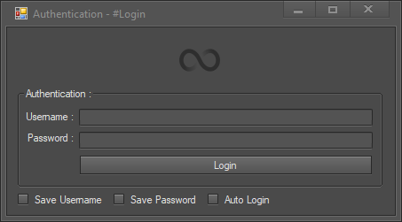

## AuthConcept :
AuthConcept is a DotNet project to give an idea to people how a login system can work with a few features such as :
* Save Username.
* Save Password.
* Auto Log.

**More features will be added, yet I'am trying to optimize and do something.**

## Task List ( In order ) :

- [x] Basic form settings
- [x] Design form UI
- [x] Rename every object/items of the form
- [ ] Save Username feature
- [ ] Save Password feature
- [ ] Auto Login feature

## Developed by :
* Sehyn

## Information :
* First of all thank you for downloading my source code.
* I Am fairly new to coding, I never had learning courses.
* Code may be a big mess for you, if this is the case apologies just trying to come up with something.
